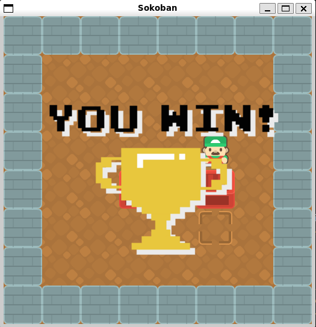

# Crate Master

## Contact
Name: Quang Tran

## Description
'Sokoban (Japanese 倉庫番 for 'warehouseman')' is a game that challenges players to push a crate to it's designated location(s) in a warehouse. In this version of the project, the program is fully completed by creating the game user interface by generating the map based on a level file using characters. The player is now allowed to move and will win if they have all of the crates on top of a storage location.

### Features
- Customizable Warehouse Layout: The program displays the walls, crates, destinations, and player depending on the text file which depicts the map. 
- Sokoban Class: The project uses a class called 'Sokoban' in order to hold class member variables and functions to put this project together. 
- SFML Integration: The project uses the Simple and Fast Multimedia Library (SFML) to display the game user interface and render the game.
- Movement and Interaction: The project allows the user to interact with the game objects to accomplish the goal of pushing crates onto a storage tile.

### Issues
At the moment, there are no known issues with the project. It appears to be functioning as intended.

## Source Files Used
- 'block_06.png'
- 'ground_01.png'
- 'crate_03.png'
- 'ground_04.png'
- 'player_05.png'
- 'victory.png'
- 'victory.wav'

These images were done by Kenney Vleugels.
The victory sound and images were found on google.

## Acknowledgements
Professor Dr. Daly provided students with knowledge that helped me build this project.
